# Readiculous Project Workflow and Architecture

This document describes the full Readiculous pipeline from Flutter UI to Node.js backend, MySQL database, and Python ML services. The diagrams use Mermaid and are intended to render in GitHub, VS Code Markdown preview, and other Mermaid-enabled viewers.

## Source Map

| Area | Main files |
| --- | --- |
| Flutter bootstrap | `frontend/lib/main.dart`, `frontend/lib/main_dev.dart`, `frontend/lib/main_prod.dart`, `frontend/lib/app_bootstrap.dart` |
| Frontend routing/session | `frontend/lib/core/routing/routing.dart`, `frontend/lib/core/session/*` |
| Frontend feature modules | `frontend/lib/core/features/*` |
| Frontend API clients | `frontend/lib/core/network/dio_client.dart`, `frontend/lib/core/network/clients/*` |
| Backend entrypoint | `backend/src/index.js` |
| Backend route/controller layer | `backend/src/routes/*`, `backend/src/controllers/*` |
| Backend services | `backend/src/services/mlService.js`, `backend/src/services/googleBooksService.js` |
| Database config/schema | `backend/src/config/db.js`, `database/schema.sql`, `backend/src/utils/readiculous.sql` |
| Demo/catalog seeding | `backend/scripts/seed_demo_data.js`, `backend/scripts/seed_books_catalog.js`, `backend/scripts/import_books_from_csv.py` |
| ML service | `ml/notebooks/features/user_book_recommender/recommender.py` |
| ML retraining | `ml/notebooks/features/user_book_recommender/retrain.py` |
| ML notebooks/artifacts | `ml/notebooks/features/user_book_recommender/good_reads_books_100k.ipynb`, `*.pkl` |

Note: the checked-in SQL files are older than the effective backend schema. They define the initial user/book/genre tables, while the current controllers and seed scripts also depend on `book_id`, inventory, librarian, read-history, recommendation, and trend tables. The ERD below documents the effective schema implied by the active backend code.

## System Context

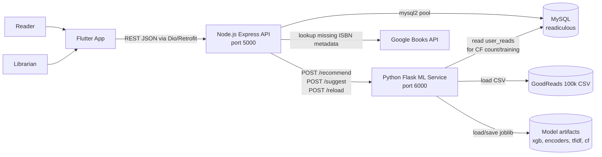

## Runtime Startup

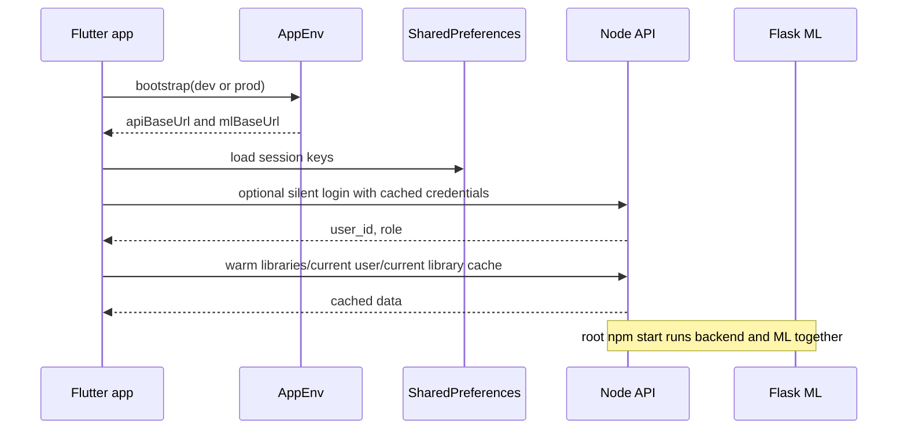

## Frontend Feature-First Architecture

The Flutter app is organized by feature under `frontend/lib/core/features`. Shared cross-cutting code lives in `core/config`, `core/routing`, `core/session`, `core/network`, `core/cache`, `core/theme`, `core/utils`, and `core/widgets`.

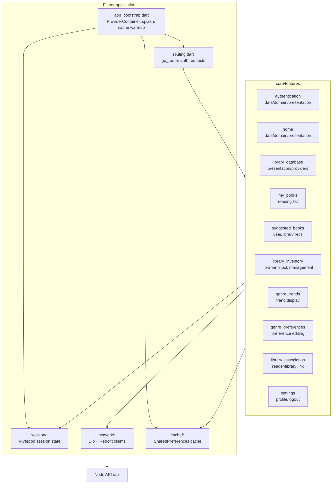

### Feature Layer Pattern

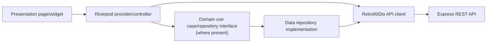

Examples:

| Feature | UI | State/API path |
| --- | --- | --- |
| Login/register | `authentication/presentation/pages/*` | `LoginController -> AuthRepositoryImpl -> AuthRemoteDataSource -> /users/login` |
| Session restore | `app_bootstrap.dart` | `SessionBootstrap -> AuthRemoteDataSource -> /users/login` |
| Library lookup | `home` | `userLibraryProvider -> HomeRepositoryImpl -> /users/:user_id/library` |
| My books | `my_books` | `myBooksProvider -> ReadsApiClient -> /reads` |
| User recommendations | `suggested_books` | `UserRecommendationsController -> /recommendations/users/:user_id/generate` |
| Library recommendations | `suggested_books` | `LibraryRecommendationsController -> /recommendations/libraries/:library_id` |
| Inventory | `library_inventory` | `LibraryInventoryNotifier -> /library-books` |
| Trends | `genre_trends` | `GenreTrendsNotifier -> /trends/top?library_id=...` |

## Backend Architecture

`backend/src/index.js` creates the Express app, applies CORS and JSON middleware, logs requests, and mounts domain route modules under `/api`.

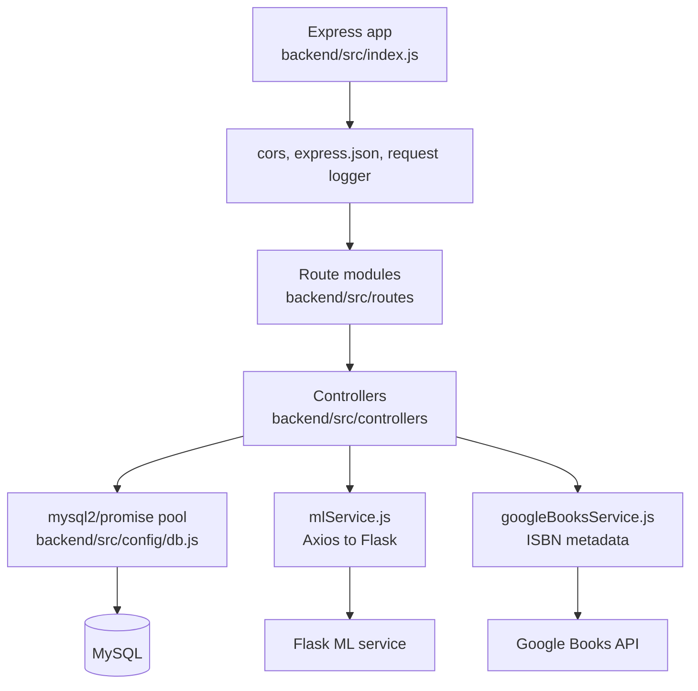

### Backend Domain Endpoints

| Domain | Route prefix | Responsibility |
| --- | --- | --- |
| Users/auth | `/api/users` | create/login/delete users, role updates, user-library association, preference aggregation |
| Genres | `/api/genres` | genre CRUD |
| User genres | `/api/user-genres` | reader genre preferences |
| Books | `/api/books` | book CRUD |
| Book genres | `/api/book-genres` | book-to-genre links |
| Libraries | `/api/libraries` | library list/create and reader activity |
| Library inventory | `/api/library-books` | library book stock records |
| Librarians | `/api/librarians` | librarian assignment and verification |
| Reads | `/api/reads` | user reading list/status/rating |
| Recommendations | `/api/recommendations` | saved and generated user/library recommendations |
| Trends | `/api/trends` | genre trend persistence and reporting |
| ML operations | `/api/ml` | retrain trigger and model reload orchestration |

## Database Model

```mermaid
erDiagram
  USERS {
    varchar user_id PK
    varchar first_name
    varchar last_name
    enum role
    date date_of_birth
    varchar location
    varchar email UK
    varchar phone
    varchar password
    timestamp created_at
  }

  LIBRARIES {
    bigint library_id PK
    varchar name
    varchar location
    varchar phone
    varchar website
    varchar county
    varchar state
    varchar zip
    varchar address
    boolean is_public
    timestamp created_at
    timestamp updated_at
  }

  GENRES {
    int genre_id PK
    varchar name UK
  }

  BOOKS {
    int book_id PK
    varchar isbn13 UK
    text title
    text author
    text description
    varchar cover_url
    timestamp created_at
    timestamp updated_at
  }

  USER_LIBRARIES {
    varchar user_id PK FK
    bigint library_id FK
    timestamp created_at
    timestamp updated_at
  }

  LIBRARIANS {
    varchar user_id FK
    bigint library_id FK
    boolean verified
    timestamp created_at
  }

  USER_GENRES {
    varchar user_id FK
    int genre_id FK
  }

  BOOK_GENRES {
    int book_id FK
    int genre_id FK
  }

  LIBRARY_BOOKS {
    bigint library_id FK
    int book_id FK
    int copies_total
    int copies_available
    int low_stock_threshold
    boolean is_deleted
  }

  USER_READS {
    varchar user_id FK
    int book_id FK
    enum status
    float rating
    timestamp created_at
    timestamp updated_at
  }

  USER_RECOMMENDATIONS {
    int recommendation_id PK
    varchar user_id FK
    int book_id FK
    float score
    text reason
    timestamp created_at
    timestamp updated_at
  }

  LIBRARY_RECOMMENDATIONS {
    int recommendation_id PK
    bigint library_id FK
    int book_id FK
    float demand_score
    enum demand_level
    text reason
    enum state
    timestamp created_at
    timestamp updated_at
  }

  GENRE_TRENDS {
    bigint library_id FK
    int genre_id FK
    float score
    timestamp captured_at
  }

  USERS ||--o| USER_LIBRARIES : "reader belongs to"
  LIBRARIES ||--o{ USER_LIBRARIES : "has readers"
  USERS ||--o{ LIBRARIANS : "may manage"
  LIBRARIES ||--o{ LIBRARIANS : "has librarians"
  USERS ||--o{ USER_GENRES : "prefers"
  GENRES ||--o{ USER_GENRES : "selected by"
  BOOKS ||--o{ BOOK_GENRES : "classified as"
  GENRES ||--o{ BOOK_GENRES : "classifies"
  LIBRARIES ||--o{ LIBRARY_BOOKS : "stocks"
  BOOKS ||--o{ LIBRARY_BOOKS : "stocked in"
  USERS ||--o{ USER_READS : "logs"
  BOOKS ||--o{ USER_READS : "read event"
  USERS ||--o{ USER_RECOMMENDATIONS : "receives"
  BOOKS ||--o{ USER_RECOMMENDATIONS : "recommended"
  LIBRARIES ||--o{ LIBRARY_RECOMMENDATIONS : "receives"
  BOOKS ||--o{ LIBRARY_RECOMMENDATIONS : "recommended"
  LIBRARIES ||--o{ GENRE_TRENDS : "tracks"
  GENRES ||--o{ GENRE_TRENDS : "trend score"
```

### Database Creation and Seeding

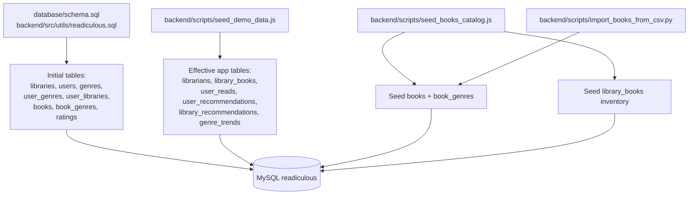

## Use Case View

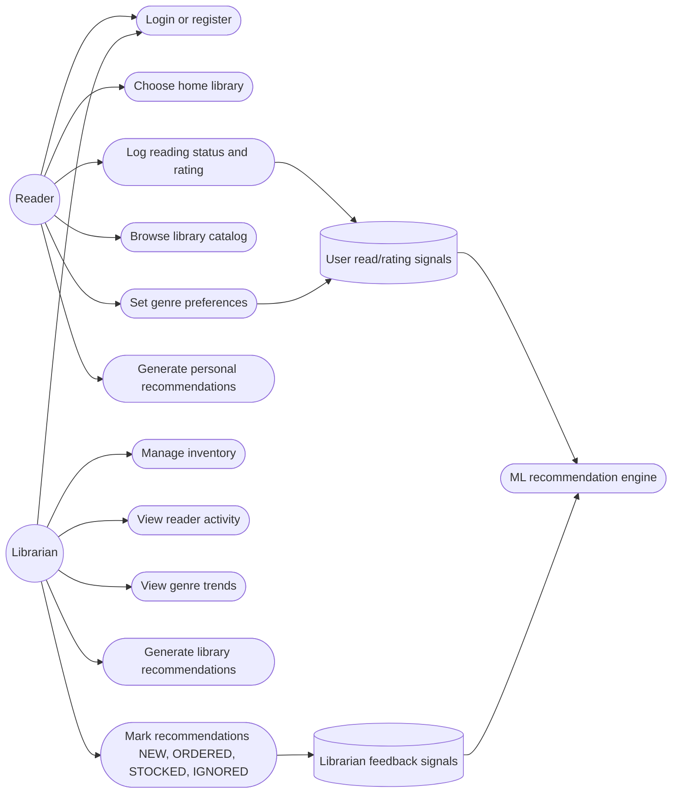

## Reader Activity Flow

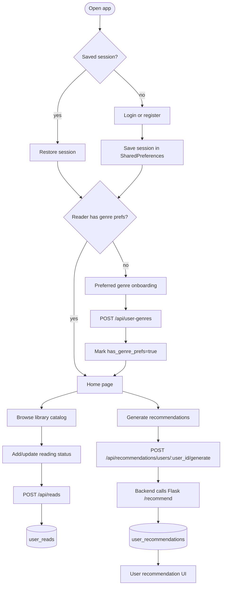

## Librarian Activity Flow

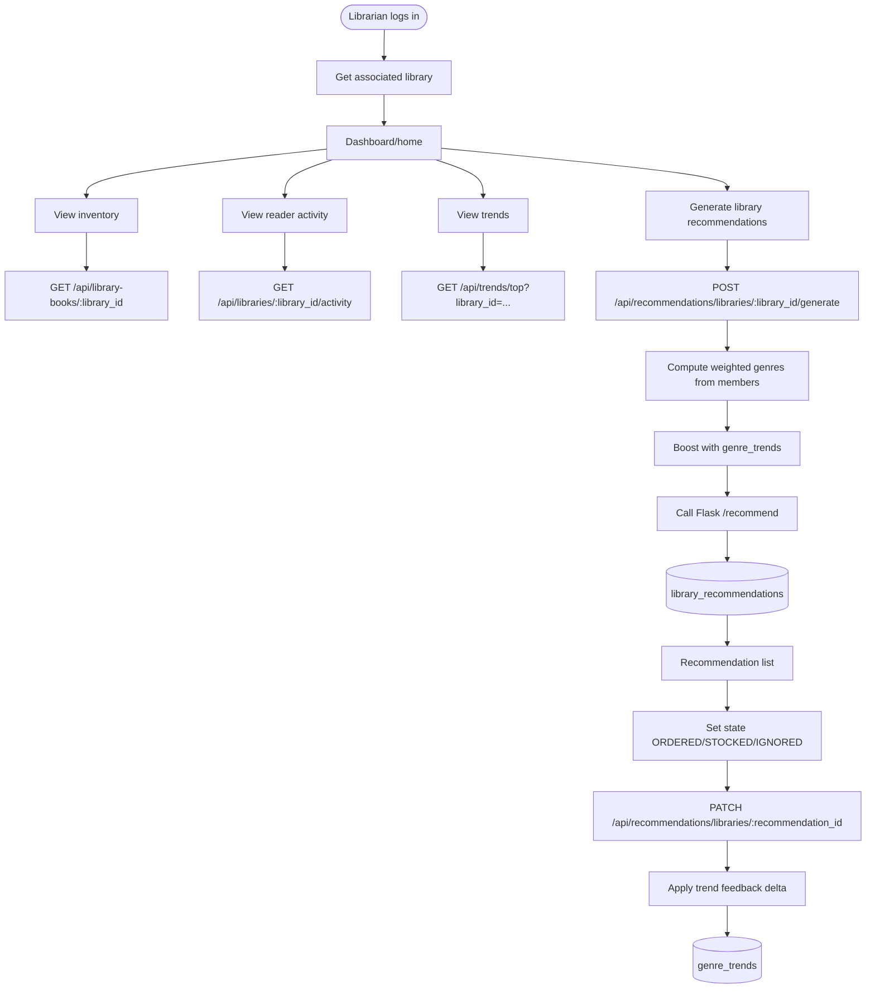

## User Recommendation Sequence

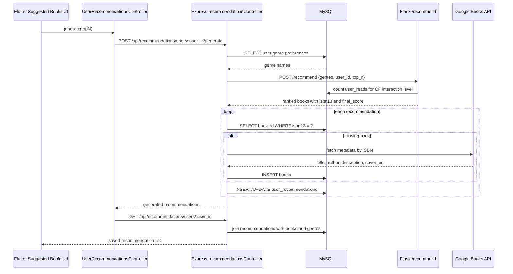

## Library Recommendation Sequence

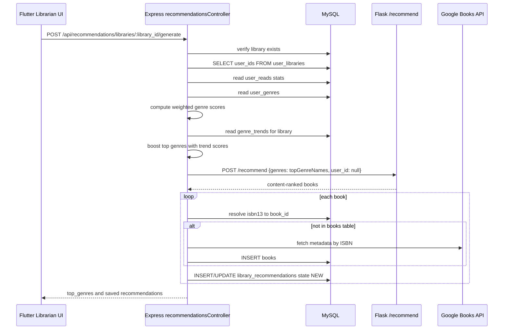

## Recommendation Feedback Loop

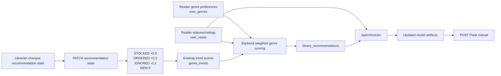

## ML Service Architecture

`recommender.py` is a Flask service. It loads the GoodReads CSV, cleans the data, loads model artifacts, and exposes recommendation endpoints.

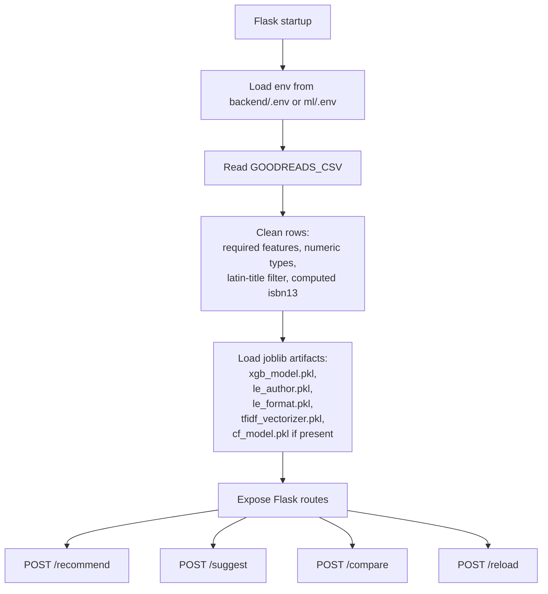

### ML Scoring Logic

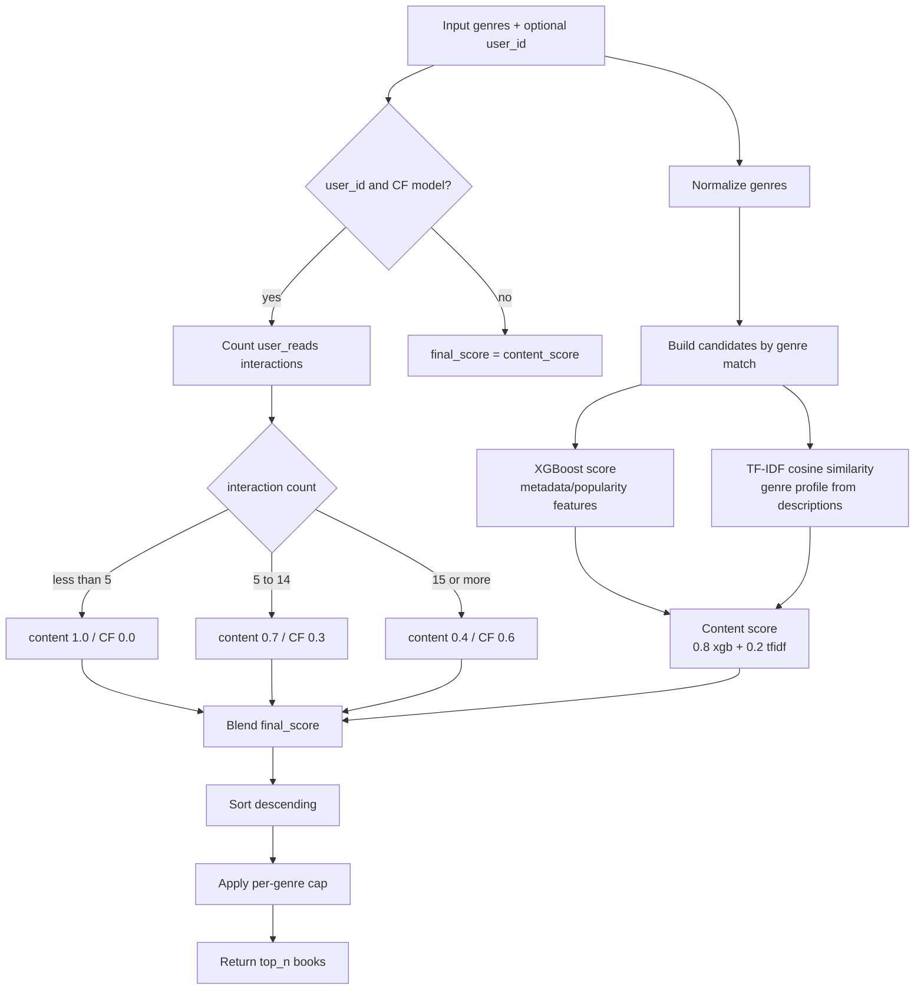

### ML Endpoint Responsibilities

| Endpoint | Used by | Responsibility |
| --- | --- | --- |
| `POST /recommend` | Backend user/library generation and some older frontend service methods | Takes genres and optional `user_id`; returns top-N content or hybrid recommendations |
| `POST /suggest` | Older frontend/service flow and documented backend service method | Aggregates user preference payloads, picks top genres, returns recommendations |
| `POST /compare` | ML testing/evaluation | Returns content-only, CF-only, and hybrid results side by side |
| `POST /reload` | Backend retraining controller | Reloads joblib artifacts into the running Flask process |
| `GET /` | Health/info | Returns service name and CF availability |

## ML Retraining Pipeline

`retrain.py` merges production signals from MySQL with the Kaggle baseline, retrains XGBoost and collaborative filtering models when enough data exists, and writes model artifacts in place.

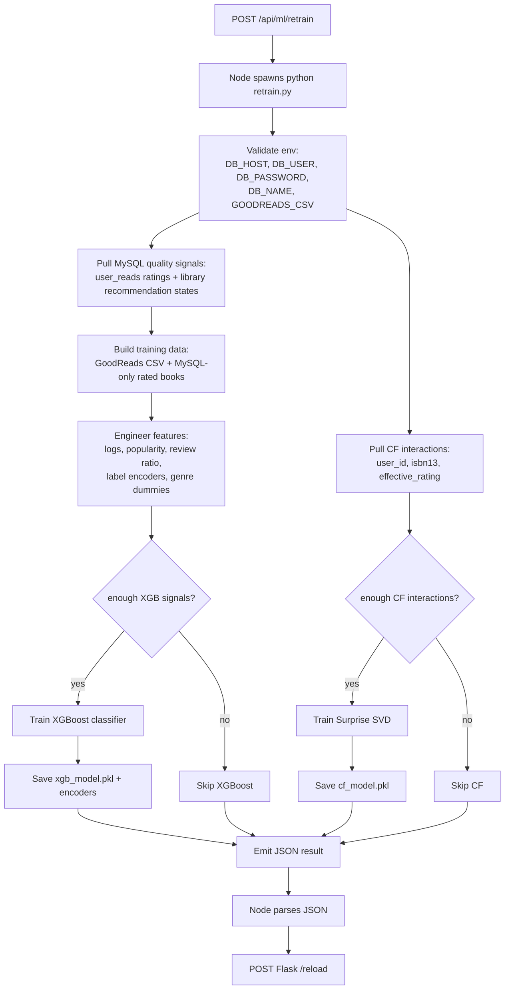

## Notebook and Model Artifact Workflow

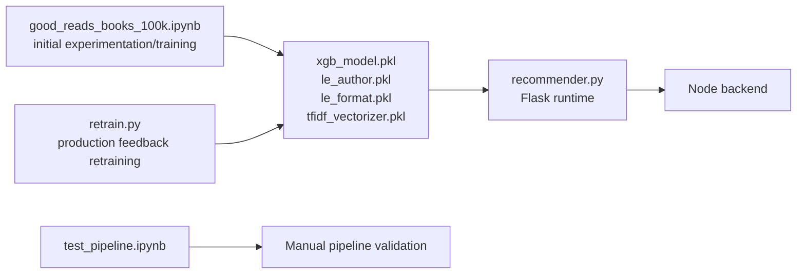

## End-to-End Data Pipeline

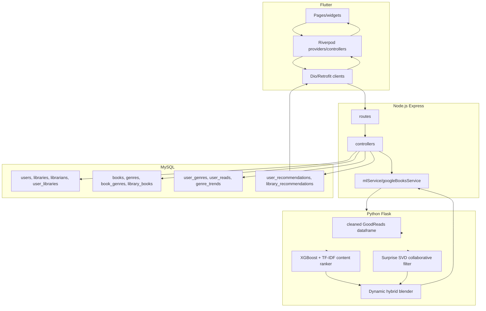

## Key Workflows by Feature

### Authentication and Session

1. User submits login/register from Flutter authentication pages.
2. `AuthRemoteDataSource` calls `/api/users/login` or `/api/users/create`.
3. Backend hashes passwords on create and verifies with bcrypt on login.
4. Flutter stores `user_id`, `role`, email, and cached password/session keys in `SharedPreferences`.
5. `go_router` redirects based on `SessionState`:
   - guests can only access login/register;
   - logged-in readers without genre preferences go to `/preferred_location`;
   - logged-in users with complete setup go to `/home_page`.

### Reader Preferences

1. Flutter loads all genres with `GET /api/genres`.
2. Reader selects genres.
3. Flutter posts `{user_id, genre_ids}` to `/api/user-genres`.
4. Backend inserts rows into `user_genres`.
5. Session marks `has_genre_prefs=true` to unlock the main app.

### Reading List

1. Flutter calls `GET /api/reads/:user_id` to load reading status.
2. Reader saves a status/rating through `POST /api/reads`.
3. Backend upserts `user_reads`.
4. `user_reads` becomes both a product feature and an ML feedback signal.

### Library Inventory

1. Flutter resolves the current user's library with `/api/users/:user_id/library`.
2. Inventory pages call `GET /api/library-books/:library_id`.
3. Librarians update copy counts and low-stock threshold with `POST /api/library-books`.
4. Backend upserts `library_books`.

### Genre Trends

1. Trend pages call `/api/trends/top?library_id=...` or `/api/trends/libraries/:library_id`.
2. Backend reads `genre_trends`.
3. Library recommendation feedback modifies trends:
   - `STOCKED`: `+0.5`
   - `ORDERED`: `+0.3`
   - `IGNORED`: `-0.3`
   - `NEW`: no signal

## Deployment and Environment

| Component | Default local address | Important env |
| --- | --- | --- |
| Flutter app | device/emulator/browser | `DEV_CONNECTION_MODE`, `DEV_API_HOST`, `DEV_ML_HOST`, `API_BASE_URL`, `ML_BASE_URL` |
| Node API | `http://localhost:5000/api` | `PORT`, `DB_HOST`, `DB_USER`, `DB_PASSWORD`, `DB_NAME`, `ML_SERVICE_URL`, `GOOGLE_BOOKS_API_KEY` |
| Flask ML | `http://localhost:6000` | `GOODREADS_CSV`, `DB_HOST`, `DB_USER`, `DB_PASSWORD`, `DB_NAME` |
| MySQL | local MySQL | database `readiculous` |

The root `package.json` starts backend and ML together:

```bash
npm start
```

Backend scripts:

```bash
npm --prefix backend start
npm --prefix backend run seed:demo
npm --prefix backend run seed:catalog
npm --prefix backend run test:user-flow
```

## Known Architecture Notes

1. The frontend mostly calls the Node backend, but `ApiService` still contains older direct Flask calls for `/recommend` and `/suggest`. The current generated recommendation controllers use the backend endpoints, which is the safer production path because it persists recommendations and resolves books.
2. The checked-in SQL files do not fully match the effective schema used by controllers and seed scripts. A future migration should consolidate the full schema into a single source of truth.
3. `ratingRoutes.js` and the empty model files are placeholders. Current ratings are stored on `user_reads.rating`.
4. The backend does not issue JWTs today. Session persistence is client-side through `SharedPreferences` and silent login.
5. Recommendation generation persists results in MySQL, so UI refreshes can fetch saved recommendations without calling ML every time.
